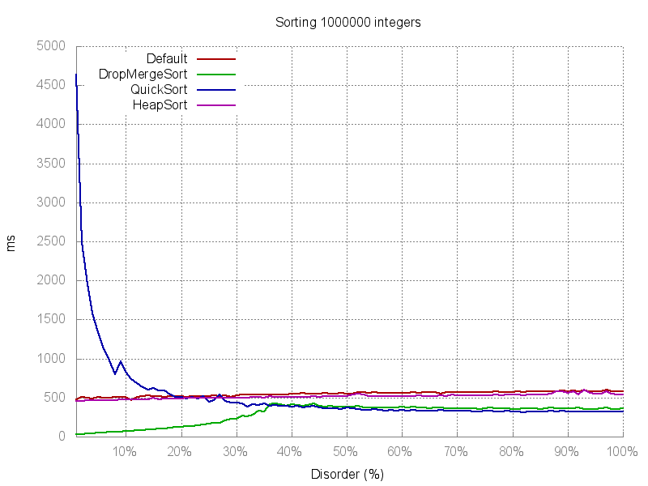
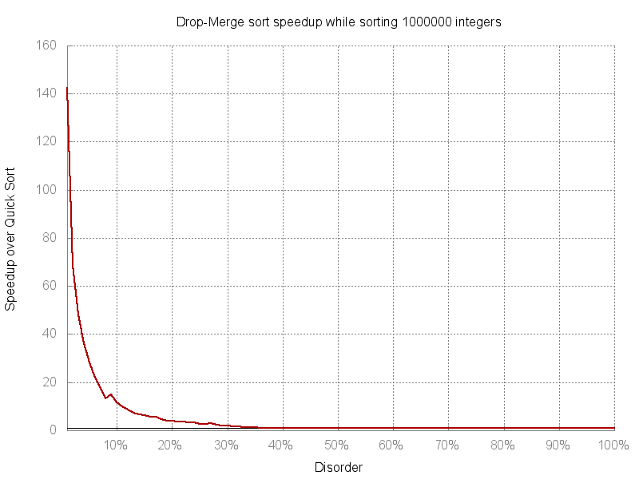
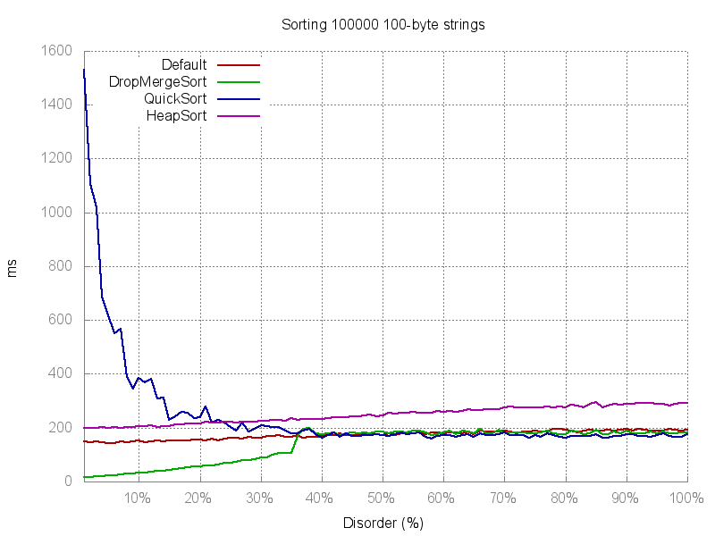
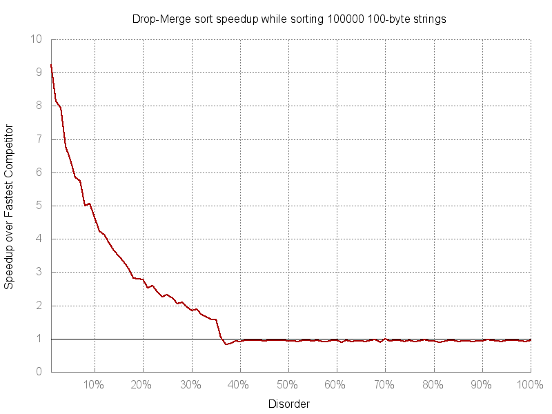

# js-drop-merge-sort [](https://travis-ci.org/Jooraz/js-drop-merge-sort)
This is a javascript implementation of drop-merge sort algorithm, originally seen on:
https://github.com/emilk/drop-merge-sort

##Installation
```
npm install quick-sort.js
```

###Usage

###Example

``` javascript
var dmsort = require('drop-merge-sort');

var comparator = function(elem1, elem2) {
    return elem1 - elem2;// asc sort
};

var array = [20, 21, 22, 23, 24, 25, 26, 27, 28, 29, 10, 11, 12, 13, 14, 15, 16, 17, 18, 19];

array = dmsort(array, comparator);//desc sort

console.log(array);
```

##API

####dmsort(iterable, length, [[[fnGetter], [fnSetter]], [fnCompare]])
+ ```iterable```: object like array
+ ```fnCompare(elem1, elem2)```: function for comparing two elem of iterable
   + Optional, if not given, will use : ```elem1 - elem2```

Quicksort and Mergesort used in here are taken from https://github.com/mgechev/javascript-algorithms

Go there for details on the algorithm itself.

##Benchmarks



