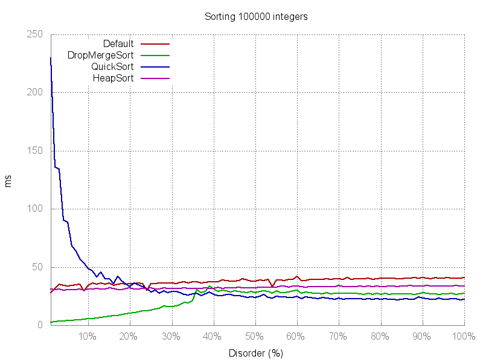
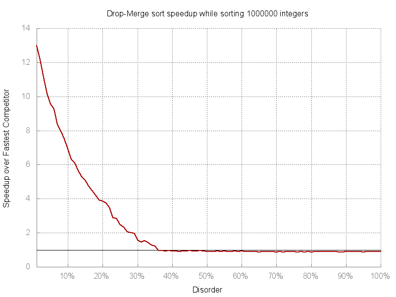

# js-drop-merge-sort 
This is a javascript implementation of drop-merge sort algorithm, originally seen on:

https://github.com/emilk/drop-merge-sort

Quicksort and Mergesort used in here are taken from https://github.com/mgechev/javascript-algorithms

Go there for details on the algorithm itself.

Benchmarks:

